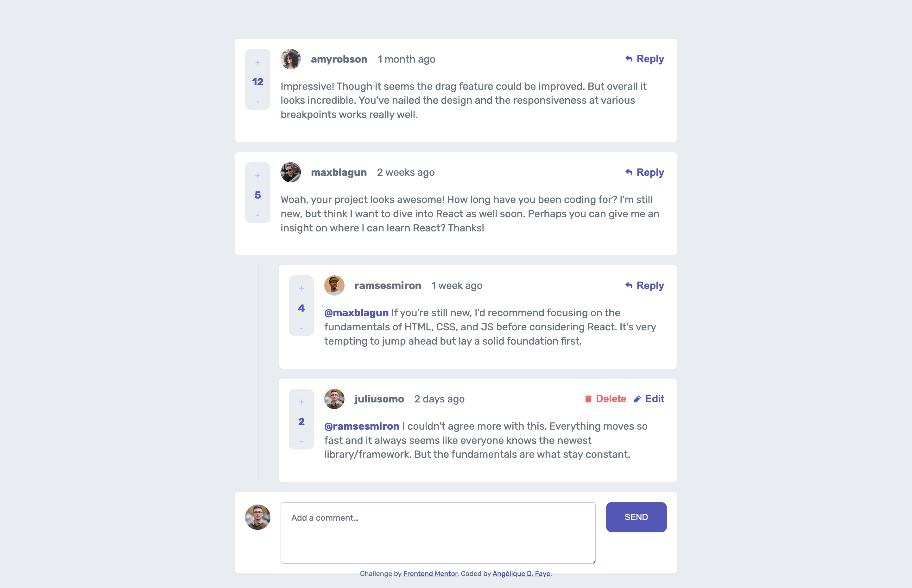

# Interactive comment section

  
  
  

## Overview

_A comment section with its own backend._

 

## Features

- Allows users to participate in a conversation (CRUD operations on comments).
- Authorize certain user interactions.
- Responsive UI.

## Author

- [@AngeliqueDF on GitHub.](https://github.com/AngeliqueDF)
- [Visit my website.](https://adf.dev)
- [View my Frontend Mentor profile.](https://www.frontendmentor.io/profile/AngeliqueDF)
